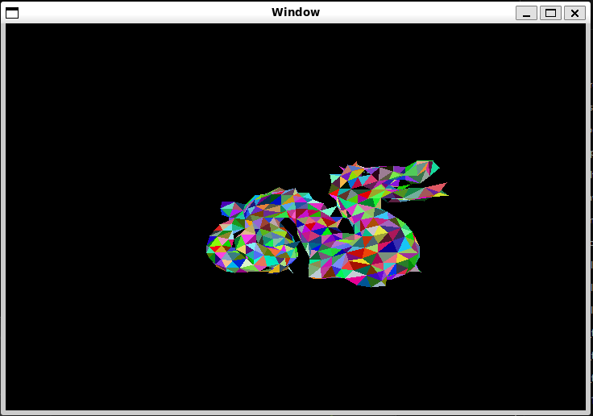

# FPGA Graphics
This is a sister repository to my [Rust graphics project](https://github.com/ryanhaus/rust_graphics). I implemented a simple 3D graphics rasterizer in SystemVerilog, note that it does not do lighting and each triangle just gets assigned a random color for now.

## Demo
I haven't tested this design out in hardware yet, but I used [Verilator](https://verilator.org) for simulation testing (note that Verilator is required to run the demo).
To run the demo, clone the repo and run `make ; ./bin/sim`. You should see a spinning dragon 3D model like this:

